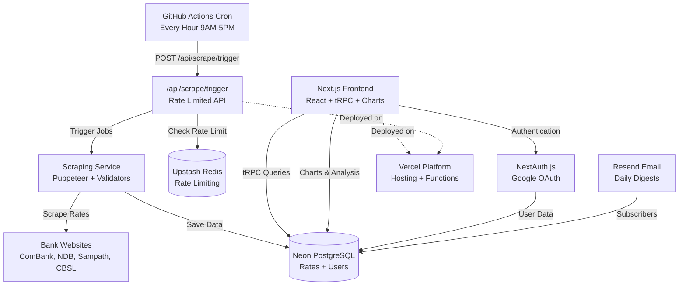

# Keep Rates - Project Architecture

## System Overview

Keep Rates is a Next.js application that tracks USD/LKR exchange rates from Sri Lankan banks using GitHub Actions for automated scraping, with rate-limited APIs, real-time data display, and tax year analysis features.

## Architecture Diagram



## Technology Stack

### **Frontend Layer**
- **Framework**: Next.js 15 with App Router
- **Language**: TypeScript for type safety
- **Styling**: Tailwind CSS with responsive design
- **State Management**: TanStack Query for server state
- **Charts**: Chart.js for rate visualizations
- **Authentication**: NextAuth.js v5 with Google OAuth

### **Backend Layer**
- **API**: tRPC for end-to-end type safety
- **Database**: Neon PostgreSQL (serverless, Vercel-optimized)
- **ORM**: Drizzle ORM with migrations
- **Rate Limiting**: Upstash Redis with sliding window
- **Web Scraping**: Puppeteer for dynamic content
- **Email Service**: Resend for transactional emails

### **Infrastructure Layer**
- **Hosting**: Vercel (free tier compatible)
- **Cron Service**: **GitHub Actions** (primary choice)
- **Database**: Neon PostgreSQL (serverless)
- **Cache/Rate Limiting**: Upstash Redis
- **Monitoring**: Built-in Vercel analytics + custom logging

## Data Flow Architecture

### 1. **Automated Data Collection**
```
GitHub Actions (Hourly) 
  ↓ HTTP POST
API Rate Limiter (Redis)
  ↓ If Allowed
Scraping Service
  ↓ Parallel Scraping
Bank Websites (4 sources)
  ↓ Extracted Data
Data Validation
  ↓ Valid Rates
PostgreSQL Database
```

### 2. **User Data Access**
```
Frontend Request
  ↓ tRPC
Server-side Handler
  ↓ SQL Query
PostgreSQL Database
  ↓ Formatted Data
React Components
  ↓ Rendered
User Interface
```

### 3. **Email Notifications**
```
Cron Trigger (Daily)
  ↓ Check Subscribers
Database Query
  ↓ Generate Content
Email Templates
  ↓ Send via Resend
User Inbox
```

## Core Components

### **1. Database Schema**

```sql
-- Core Tables
banks (id, name, code, display_name, website_url, scrape_config, is_active)
exchange_rates (id, bank_id, buying_rate, selling_rate, indicative_rate, scraped_at)
users (id, name, email, emailVerified, image) -- NextAuth.js schema
user_subscriptions (id, user_id, subscription_type, is_active, preferences)

-- Logging & Monitoring
scrape_logs (id, bank_id, status, rates_found, error_message, scraped_at)
email_logs (id, user_id, email_type, sent_at, status)

-- Indexes for Performance
idx_exchange_rates_bank_scraped (bank_id, scraped_at DESC)
idx_exchange_rates_scraped_at (scraped_at DESC)
```

### **2. API Architecture**

```typescript
// External Scraping API
POST /api/scrape/trigger
- Rate limiting: 1 call/hour
- Authentication: API key header
- Response: Job ID + status

// tRPC API Routes
/api/trpc/banks.*
/api/trpc/rates.*
/api/trpc/subscriptions.*
/api/trpc/users.*

// NextAuth.js Routes
/api/auth/*
```

### **3. Scraping Service Architecture**

```typescript
// Base Interface
interface ExchangeRateScraper {
  bankId: string;
  bankName: string;
  baseUrl: string;
  scrapeRates(): Promise<ExchangeRateData>;
  validateData(data: ExchangeRateData): boolean;
}

// Individual Scrapers
class CommercialBankScraper implements ExchangeRateScraper
class NDBBankScraper implements ExchangeRateScraper
class SampathBankScraper implements ExchangeRateScraper
class CBSLScraper implements ExchangeRateScraper

// Orchestration
class ScrapingService {
  triggerAllScrapingJobs(): Promise<string>
  executeScrapingJob(jobId: string): Promise<void>
}
```

### **4. Frontend Component Structure**

```
src/app/
├── page.tsx                    # Homepage with current rates
├── banks/[id]/page.tsx         # Individual bank pages
├── tax-years/page.tsx          # Tax year summary tables
├── dashboard/page.tsx          # User dashboard
└── _components/
    ├── RateCard.tsx           # Current rate display
    ├── RateChart.tsx          # Historical rate charts
    ├── TaxYearTable.tsx       # Monthly tax summaries
    ├── SubscriptionForm.tsx   # Email subscription
    └── Navbar.tsx             # Navigation
```

## Implementation Phases

### **Phase 1: Core Infrastructure** (Week 1-2)
1. **Database Setup**
   - Set up Neon PostgreSQL
   - Create Drizzle schema
   - Run initial migrations
   - Seed bank data

2. **API Foundation**
   - Create `/api/scrape/trigger` endpoint
   - Set up Upstash Redis rate limiting
   - Implement basic error handling

3. **GitHub Actions Setup**
   - Create workflow file
   - Configure secrets
   - Test manual triggers

### **Phase 2: Data Collection** (Week 2-3)
1. **Scraping Service**
   - Implement base scraper interface
   - Create individual bank scrapers
   - Add data validation
   - Implement retry logic

2. **Data Processing**
   - Save rates to database
   - Log scraping activities
   - Handle error cases

### **Phase 3: Frontend & API** (Week 3-4)
1. **tRPC Setup**
   - Create bank, rates, and subscription routers
   - Implement tax year queries
   - Add data aggregation

2. **Frontend Components**
   - Homepage with current rates
   - Individual bank pages
   - Tax year summary tables
   - Basic responsive design

### **Phase 4: User Features** (Week 4-5)
1. **Authentication**
   - NextAuth.js setup with Google
   - User profile management
   - Protected routes

2. **Email System**
   - Subscription management
   - Daily digest emails
   - Rate alert notifications

### **Phase 5: Polish & Deploy** (Week 5-6)
1. **UI/UX Enhancement**
   - Interactive charts
   - Mobile optimization
   - Loading states

2. **Production Deployment**
   - Vercel deployment
   - Environment configuration
   - Monitoring setup

## Security & Performance

### **Security Measures**
- API key authentication for scraping endpoint
- Rate limiting with Redis (1 call/hour)
- Input validation and sanitization
- NextAuth.js secure session management
- Environment variable protection

### **Performance Optimizations**
- Database indexing for fast queries
- tRPC for efficient data fetching
- Redis caching for rate limits
- Vercel edge functions for global performance
- Incremental Static Regeneration for static content

## Monitoring & Maintenance

### **Logging Strategy**
- Scraping success/failure logs
- API endpoint usage monitoring
- Email delivery tracking
- Error aggregation and alerting

### **Health Checks**
- Database connectivity monitoring
- Redis availability checks
- Bank website accessibility
- Email service status

### **Backup & Recovery**
- Automated Neon PostgreSQL backups
- Configuration as code (GitHub)
- Environment variable management
- Disaster recovery procedures

## Environment Configuration

### **Development**
```env
# Database
STORAGE_DATABASE_URL="postgresql://localhost:5432/keeprates_dev"

# Authentication
AUTH_SECRET="dev-secret-key"
AUTH_URL="http://localhost:3000"

# External Services
SCRAPING_API_KEY="dev-api-key"
UPSTASH_REDIS_REST_URL="redis-dev-url"
RESEND_API_KEY="resend-dev-key"
```

### **Production**
```env
# Database (Neon)
STORAGE_DATABASE_URL="postgresql://neon-prod-connection"

# Authentication
AUTH_SECRET="production-secret"
AUTH_URL="https://keep-rates-2.vercel.app"

# External Services  
SCRAPING_API_KEY="secure-production-key"
UPSTASH_REDIS_REST_URL="redis-prod-url"
RESEND_API_KEY="resend-prod-key"
```

## GitHub Actions Workflow

### **Primary Workflow: Scraping Trigger**
```yaml
name: 🏦 Scrape Exchange Rates
on:
  schedule:
    - cron: '0 9,10,11,12,13,14,15,16,17 * * 1-5'
  workflow_dispatch:

jobs:
  trigger-scraping:
    runs-on: ubuntu-latest
    steps:
      - name: Trigger API
        run: |
          curl -X POST \
            -H "x-api-key: ${{ secrets.SCRAPING_API_KEY }}" \
            "${{ secrets.APP_URL }}/api/scrape/trigger"
```

### **Additional Workflows**
- **Health Check**: Daily application health monitoring
- **Data Validation**: Weekly data integrity checks
- **Backup Verification**: Monthly backup testing

## Scalability Considerations

### **Current Architecture Supports**
- **Traffic**: Up to 10,000 monthly active users
- **Data**: 5+ years of historical rate data
- **Scraping**: 4 banks with hourly updates
- **Email**: 1000+ subscribers with daily digests

### **Future Scaling Options**
- **More Banks**: Easy to add new scrapers
- **Higher Frequency**: Increase scraping intervals
- **API Access**: Public API for third-party developers
- **Mobile App**: React Native using same backend
- **Additional Currencies**: EUR/LKR, GBP/LKR support

## Cost Estimation

### **Monthly Costs (Production)**
- **Vercel**: $0 (Free tier)
- **Neon PostgreSQL**: $0-20 (depending on usage)
- **Upstash Redis**: $0-10 (rate limiting usage)
- **Resend Email**: $0-20 (based on email volume)
- **GitHub Actions**: $0 (free for public repos)

**Total Estimated Monthly Cost: $0-50**

This architecture is designed to be **cost-effective**, **scalable**, and **maintainable** while providing a robust foundation for the Keep Rates application.
